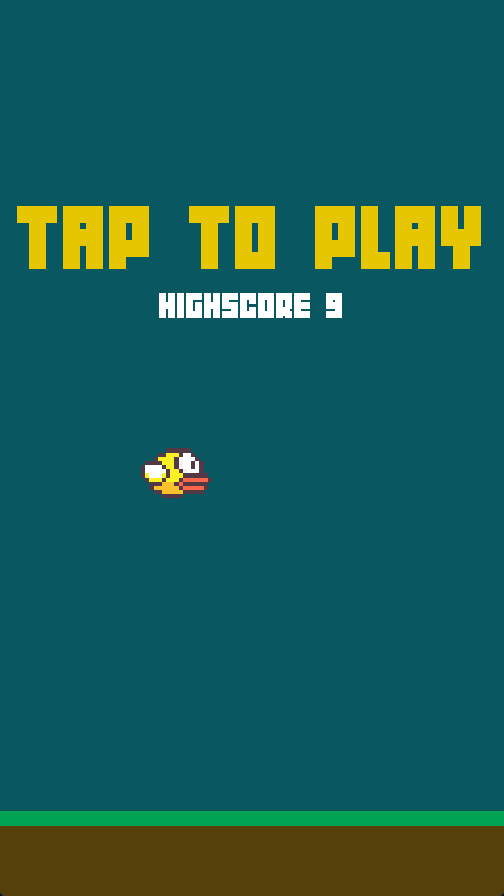
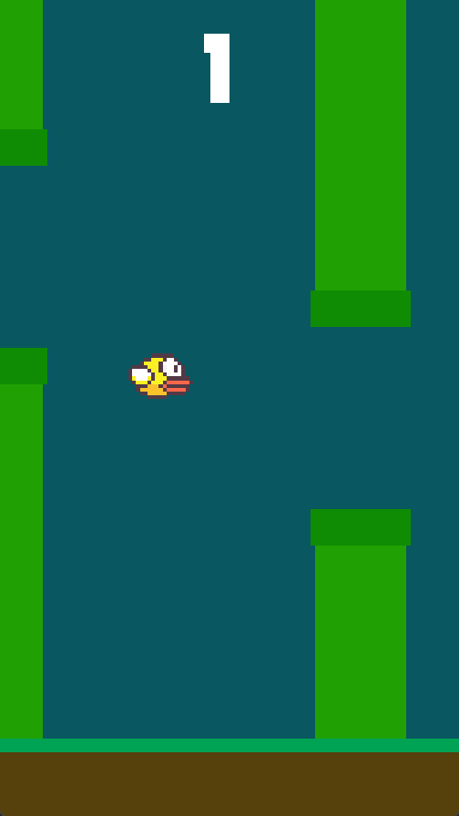
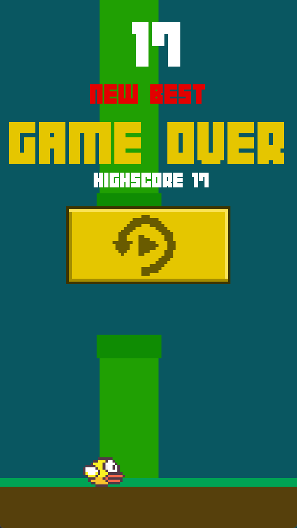

# About
Clone of the Flappy Bird game created in Python using the Pygame library. The project was completed at the end of 2018.

The highest score achieved is saved in a binary file and secured with a SHA-256 cryptographic hash, making it more difficult to modify.

To run:
```bash
python main.py
```

# Preview




